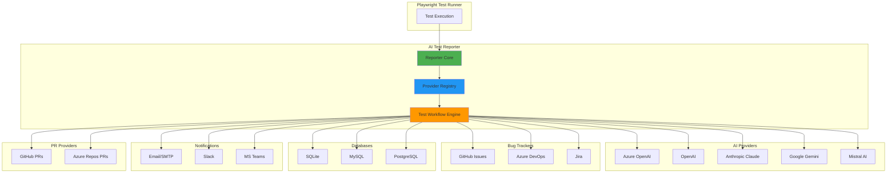
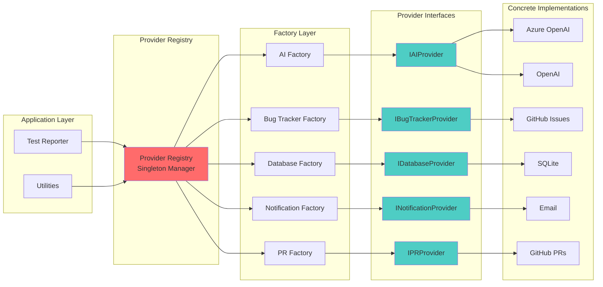
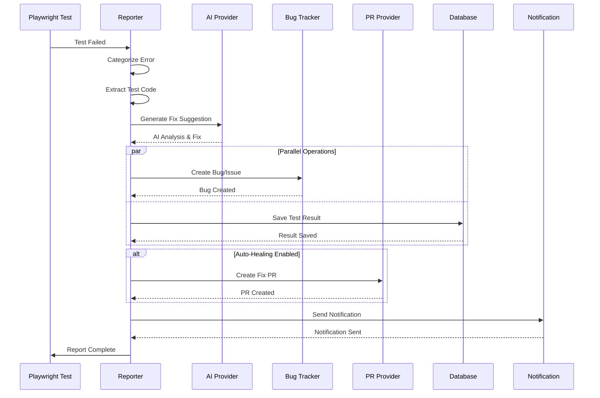

<div align="center">
  
  
  <h1><strong>Playwright AI Reporter</strong></h1>

[](https://github.com/deepakkamboj/playwright-ai-reporter/actions/workflows/ci.yml)
[](https://www.npmjs.com/package/playwright-ai-reporter)
[](https://www.typescriptlang.org/)
[](https://playwright.dev/)
[](https://opensource.org/licenses/MIT)
[](https://nodejs.org/)

  <p><strong>Transform test failures into actionable insights with AI-powered analysis and auto-healing</strong></p>
</div>

**Playwright AI Reporter** is an enterprise-grade, production-ready test reporter that combines artificial intelligence with comprehensive test automation workflows. Built on a flexible provider-based architecture, it automatically analyzes test failures, creates detailed bug reports, generates fix suggestions, and can even submit auto-healing pull requests—all while integrating seamlessly with your existing development tools.

### 🎯 **Why Choose Playwright AI Reporter?**

- **🧠 AI-Powered Analysis** - Multiple AI providers (Azure OpenAI, Anthropic Claude, Google Gemini, Mistral, OpenAI) analyze failures and suggest intelligent fixes
- **🔌 Plug & Play Architecture** - Swap bug trackers, databases, AI providers, and notification systems without code changes
- **🚀 Auto-Healing Tests** - Automatically generate and submit PRs with AI-suggested fixes for flaky or failing tests
- **📊 Enterprise Integration** - Native support for GitHub, Azure DevOps, Jira, MySQL, SQLite, SMTP, and more
- **🎨 Rich Reporting** - Colorized console output, comprehensive metrics, historical analysis, and build integration
- **⚡ Production-Ready** - TypeScript, fully tested, extensive documentation, CI/CD workflows included

> 💡 **Perfect for** - CI/CD pipelines • Enterprise test automation • Multi-team projects • Flaky test management • Test debugging at scale

---

## **📖 Table of Contents**

- [Features](#-features)
- [Architecture](#-architecture)
- [Quick Start](#-quick-start)
- [Installation](#-installation)
- [Configuration](#-configuration)
- [Provider Support](#-provider-support)
- [Usage Examples](#-usage-examples)
- [Output Examples](#-output-examples)
- [FAQs](#-frequently-asked-questions-faqs)
- [Documentation](#-documentation)
- [Contributing](#-contributing)
- [License](#-license)

---

## **✨ Features**

### 🎨 **Smart Reporting & Visualization**

- ✅ Colorized console output (Passed, Failed, Retries, Skipped)
- 📊 Comprehensive test metrics and statistics
- 🎯 Slowest test identification and ranking
- ⏱️ Average test duration analysis
- 📈 Test history tracking and comparison
- 🏗️ CI/CD integration with build information
- 🌐 **Interactive HTML Report**: Self-contained HTML dashboard with charts, test details, and AI fix suggestions

### 🤖 **AI-Powered Intelligence**

- 🧠 **Multi-AI Provider Support**: Azure OpenAI, OpenAI, Anthropic (Claude), Google AI (Gemini), Mistral AI
- 🔧 **Automatic Fix Suggestions**: AI analyzes failures and suggests fixes
- 📝 **Context-Aware Analysis**: Includes test code, error details, and stack traces
- 🎓 **Smart Categorization**: Automatic error categorization (Timeout, Selector, Network, etc.)
- 💡 **Best Practices**: Suggestions follow Playwright best practices

### 🐛 **Automated Bug Management**

- 🎫 **Multi-Platform Bug Creation**: GitHub Issues, Azure DevOps Work Items, Jira Tickets
- 📋 **Rich Bug Details**: Test info, error details, AI suggestions, environment data
- 🏷️ **Smart Labeling**: Automatic labels and priority assignment
- 🔗 **Integrated Tracking**: Links bugs to test runs and failures

### 🔄 **Auto-Healing & PR Generation**

- 🚀 **Automatic PR Creation**: Generate PRs with AI-suggested fixes (set `generatePR: true`)
- 🌿 **Branch Management**: Auto-create topic branches (`autofix/test-name-timestamp`)
- 💾 **Smart Commits**: Commit fixes to topic branch with detailed messages
- 📤 **Push & PR**: Push changes and create pull request from topic to base branch
- 📝 **Rich PR Descriptions**: Include error analysis, test details, and fix rationale
- 🎯 **Draft PRs**: Created as drafts for mandatory code review
- 🏷️ **Auto Labels**: `auto-fix`, `test-failure`, `ai-generated` labels
- ⚙️ **Platform Support**: GitHub and Azure DevOps

### 💾 **Database & Analytics**

- 📊 **Test Run Tracking**: Store complete test run metadata (environment, branch, commit, totals, duration)
- 📈 **Result History**: Track individual test results over time with full details
- 🔍 **Failure Analysis**: Query and analyze failure patterns with indexed searches
- 🏗️ **Build Integration**: Link results to CI/CD builds with metadata
- 💾 **Multi-Database**: SQLite (file-based), MySQL, PostgreSQL support
- 🗃️ **Schema**: 2 tables (`test_runs`, `test_results`) with 4 performance indexes

---

## **🏗️ Architecture**

### **System Overview**



### **Provider Architecture**

The reporter uses a **provider-based architecture** for maximum flexibility:



### **Test Failure Workflow**



### **Core Components**

| Component             | Description                                                   |
| --------------------- | ------------------------------------------------------------- |
| **Reporter**          | Main entry point implementing Playwright's Reporter interface |
| **Provider Registry** | Centralized provider management with lazy initialization      |
| **AI Providers**      | Multiple AI service implementations for fix suggestions       |
| **Bug Trackers**      | Issue/ticket creation across platforms                        |
| **Databases**         | Test result storage and historical analysis                   |
| **PR Providers**      | Automated pull request creation                               |
| **Notifications**     | Alert delivery across channels                                |
| **Factories**         | Provider instantiation with configuration                     |
| **Workflow Engine**   | Orchestrates the test failure handling process                |

### **Design Principles**

- 🔌 **Provider Independence** - Not locked into any single service
- 🏭 **Factory Pattern** - Clean, standardized provider creation
- ⚡ **Lazy Initialization** - Resources loaded only when needed
- 🛡️ **Type Safety** - Full TypeScript support
- 🧪 **Testable** - Easy mocking for unit tests
- 📦 **Modular** - Import only what you need

---

## **⚡ Quick Start**

### **Prerequisites**

- Node.js 18 or higher
- Playwright 1.51 or higher
- An AI provider API key (Azure OpenAI, OpenAI, Anthropic, Google AI, or Mistral)

### **1. Installation**

```bash
# Install the reporter
npm install playwright-ai-reporter --save-dev

# Install optional peer dependencies based on your needs
npm install @azure/identity        # For Azure OpenAI with Managed Identity
npm install @octokit/rest          # For GitHub integration
npm install azure-devops-node-api  # For Azure DevOps integration
npm install mysql2                 # For MySQL database
npm install nodemailer            # For email notifications
```

### **2. Choose a Configuration Stack**

Copy one of the pre-configured environment files from the examples:

```bash
# GitHub + Mistral AI + SQLite
cp examples/env-configs/.env.github-stack .env

# OR Azure DevOps + Azure OpenAI + MySQL
cp examples/env-configs/.env.azure-stack .env

# OR Jira + OpenAI + SQLite
cp examples/env-configs/.env.openai-jira .env

# OR Claude AI only (minimal setup)
cp examples/env-configs/.env.anthropic-minimal .env
```

### **3. Configure Your Credentials**

Edit your `.env` file with your API keys and settings:

```env
# AI Provider (choose one)
AI_PROVIDER=mistral
MISTRAL_API_KEY=your-api-key-here

# Bug Tracker (optional)
BUG_TRACKER_PROVIDER=github
GITHUB_TOKEN=ghp_your_personal_access_token
GITHUB_OWNER=your-org
GITHUB_REPO=your-repo

# Database (optional)
DATABASE_PROVIDER=sqlite
SQLITE_DATABASE_PATH=./data/test-results.db

# PR Provider (optional - for auto-PR generation)
PR_PROVIDER=github
BASE_BRANCH=main
```

### **4. Add to Playwright Config**

Update your `playwright.config.ts`:

```typescript
import {defineConfig} from '@playwright/test';

export default defineConfig({
    reporter: [
        ['list'],
        [
            'playwright-ai-reporter',
            {
                // Test thresholds
                slowTestThreshold: 3,
                maxSlowTestsToShow: 5,

                // Output
                outputDir: './test-results',
                showStackTrace: true,

                // AI & Automation features
                generateFix: true, // Generate AI fix suggestions
                createBug: false, // Auto-create bugs for failures
                generatePR: false, // Auto-create PRs with fixes
                publishToDB: false, // Save to database
                sendEmail: false, // Send email notifications
            },
        ],
    ],
});
```

### **5. Validate Setup**

```bash
# From the examples folder
cd examples
npm install
npm run validate:config  # Check configuration
```

### **6. Run Your Tests**

```bash
# From the examples folder
npm test
```

That's it! The reporter will now analyze failures, generate AI-powered fix suggestions, and optionally create bugs, PRs, or store results in a database based on your configuration.

---

## **🚀 Installation**

### **NPM**

```bash
npm install playwright-ai-reporter --save-dev
```

### **Yarn**

```bash
yarn add -D playwright-ai-reporter
```

### **PNPM**

```bash
pnpm add -D playwright-ai-reporter
```

---

## **⚙️ Configuration**

### **Reporter Configuration Options**

| Option                    | Type      | Default          | Description                                              |
| ------------------------- | --------- | ---------------- | -------------------------------------------------------- |
| `slowTestThreshold`       | `number`  | `5`              | Tests slower than this (seconds) are flagged as slow     |
| `maxSlowTestsToShow`      | `number`  | `3`              | Maximum number of slow tests to display in report        |
| `timeoutWarningThreshold` | `number`  | `30`             | Warn if tests approach this timeout value (seconds)      |
| `showStackTrace`          | `boolean` | `true`           | Include full stack traces in error reports               |
| `outputDir`               | `string`  | `./test-results` | Directory for JSON output files and AI-generated fixes   |
| `generateFix`             | `boolean` | `false`          | Generate AI-powered fix suggestions (saves to files)     |
| `createBug`               | `boolean` | `false`          | Auto-create bugs for failures (requires bug tracker)     |
| `generatePR`              | `boolean` | `false`          | Auto-create PRs with fixes (requires `generateFix=true`) |
| `publishToDB`             | `boolean` | `false`          | Publish test results to database (requires DB provider)  |
| `sendEmail`               | `boolean` | `false`          | Send email notifications (requires email configuration)  |

### **Feature Workflows**

#### **Generate Fix Only** (Default)

```typescript
{ generateFix: true, createBug: false, generatePR: false, publishToDB: false }
// → Creates AI fix suggestions in test-results/fixes/
```

#### **Create Bugs for Failures**

```typescript
{ generateFix: false, createBug: true, generatePR: false, publishToDB: false }
// → Creates bugs in GitHub/Jira/Azure DevOps for each failure
```

#### **Generate Fix + Auto PR**

```typescript
{ generateFix: true, createBug: false, generatePR: true, publishToDB: false }
// → Creates fix files + topic branch + draft PR with fixes
```

#### **Full Stack** (All Features)

```typescript
{ generateFix: true, createBug: true, generatePR: true, publishToDB: true, sendEmail: true }
// → AI fixes + bug tracking + PRs + database logging + email notifications
```

### **Workflow: AI Fix → Topic Branch → PR**

1. **Test Fails** → AI analyzes failure and generates fix suggestion
2. **Generate Fix** (`generateFix: true`) → Creates fix files in `test-results/fixes/`
3. **Create Branch** (`generatePR: true`) → Creates topic branch `autofix/test-name-{timestamp}`
4. **Commit Changes** → Commits AI fix to topic branch with detailed message
5. **Create PR** → Opens draft PR from topic branch → base branch with:
    - Error details and AI analysis
    - Labels: `auto-fix`, `test-failure`, `ai-generated`
    - Links to commit and test details
6. **Review & Merge** → Team reviews draft PR before merging

---

## **🔌 Provider Support**

### **AI Providers**

| Provider               | Status              | Configuration                                           |
| ---------------------- | ------------------- | ------------------------------------------------------- |
| **Azure OpenAI**       | ✅ Production Ready | `AZURE_OPENAI_ENDPOINT`, `AZURE_OPENAI_DEPLOYMENT_NAME` |
| **OpenAI**             | ✅ Production Ready | `OPENAI_API_KEY`, `OPENAI_MODEL`                        |
| **Anthropic (Claude)** | ✅ Production Ready | `ANTHROPIC_API_KEY`, `ANTHROPIC_MODEL`                  |
| **Google AI (Gemini)** | ✅ Production Ready | `GOOGLE_AI_API_KEY`, `GOOGLE_AI_MODEL`                  |
| **Mistral AI**         | ✅ Production Ready | `MISTRAL_API_KEY`, `MISTRAL_MODEL`                      |

### **Bug Trackers**

| Provider          | Status              | Configuration                                                      |
| ----------------- | ------------------- | ------------------------------------------------------------------ |
| **GitHub Issues** | ✅ Production Ready | `GITHUB_TOKEN`, `GITHUB_OWNER`, `GITHUB_REPO`                      |
| **Azure DevOps**  | ✅ Production Ready | `AZURE_DEVOPS_ORG_URL`, `AZURE_DEVOPS_PROJECT`, `AZURE_DEVOPS_PAT` |
| **Jira**          | ✅ Production Ready | `JIRA_HOST`, `JIRA_EMAIL`, `JIRA_API_TOKEN`, `JIRA_PROJECT_KEY`    |

### **Databases**

| Provider       | Status              | Configuration                                                  |
| -------------- | ------------------- | -------------------------------------------------------------- |
| **SQLite**     | ✅ Production Ready | `SQLITE_DB_PATH` (optional)                                    |
| **MySQL**      | ✅ Production Ready | `MYSQL_HOST`, `MYSQL_USER`, `MYSQL_PASSWORD`, `MYSQL_DATABASE` |
| **PostgreSQL** | 🚧 Coming Soon      | -                                                              |

### **Notifications**

| Provider            | Status              | Configuration                                                          |
| ------------------- | ------------------- | ---------------------------------------------------------------------- |
| **Email (SMTP)**    | ✅ Production Ready | `EMAIL_HOST`, `EMAIL_USER`, `EMAIL_PASSWORD`, `EMAIL_FROM`, `EMAIL_TO` |
| **Slack**           | 🚧 Coming Soon      | `SLACK_WEBHOOK_URL`                                                    |
| **Microsoft Teams** | 🚧 Coming Soon      | `TEAMS_WEBHOOK_URL`                                                    |

### **PR Providers**

| Provider         | Status              | Configuration                       |
| ---------------- | ------------------- | ----------------------------------- |
| **GitHub**       | ✅ Production Ready | Uses `GITHUB_*` configuration       |
| **Azure DevOps** | ✅ Production Ready | Uses `AZURE_DEVOPS_*` configuration |

---

## **💻 Usage Examples**

### **Basic Usage (Environment Variables)**

```typescript
// playwright.config.ts
import {defineConfig} from '@playwright/test';

export default defineConfig({
    reporter: [
        [
            'playwright-ai-reporter',
            {
                generateFix: true,
                categorizeFailures: true,
                slowTestThreshold: 3,
                maxSlowTestsToShow: 5,
            },
        ],
    ],
});
```

### **Using Provider Registry**

```typescript
import {ProviderRegistry} from 'playwright-ai-reporter';

// Initialize providers
await ProviderRegistry.initialize({
    ai: {type: 'openai'},
    bugTracker: {type: 'github'},
    database: {type: 'sqlite'},
});

// Get providers
const ai = await ProviderRegistry.getAIProvider();
const bugTracker = await ProviderRegistry.getBugTrackerProvider();
const db = await ProviderRegistry.getDatabaseProvider();
```

### **Direct Factory Usage**

```typescript
import {AIProviderFactory} from 'playwright-ai-reporter';

// Create specific provider
const provider = await AIProviderFactory.createProvider('anthropic');

// Generate completion
const response = await provider.generateCompletion([
    {role: 'system', content: 'You are a test engineer.'},
    {role: 'user', content: 'Analyze this test failure...'},
]);

console.log(response.content);
```

### **Complete Workflow Example**

```typescript
import {ReporterWorkflow} from 'playwright-ai-reporter';

// Initialize
await ReporterWorkflow.initialize();

// Process test failure
await ReporterWorkflow.processTestFailure(failure, sourceCode);

// Save test run
const runId = await ReporterWorkflow.saveTestRun(summary);

// Send notifications
await ReporterWorkflow.sendNotification(summary, failures);

// Cleanup
await ReporterWorkflow.cleanup();
```

For more examples, check the **[examples](./examples/)** folder.

---

## **📋 Output Examples**

### **Successful Run**

```plaintext
🚀 Starting test run: 3 tests using 2 workers
✅ Login test passed in 1.23s
✅ API integration test passed in 2.45s
⚠️ Payment test was skipped

✅ All 3 tests passed | 1 skipped | ⏱ Total: 3.68s

🖥️ Running locally

Additional Metrics:
- Average passed test time: 1.84s
- Slowest test took: 2.45s
- Top 3 slowest tests:
  1. API integration test: 2.45s
  2. Login test: 1.23s

⚠️ Warning: 1 test was skipped.
   Please ensure to test the skipped scenarios manually before deployment.
```

### **Failed Run with AI Fix Suggestions**

```plaintext
🚀 Starting test run: 3 tests using 2 workers
✅ Login test passed in 1.23s
❌ API test failed in 2.45s
🔄 Retry attempt for "API test" (failed) in 2.50s
⚠️ Payment test was skipped

❌ 1 of 3 tests failed | 1 passed | 1 skipped | ⏱ Total: 6.18s

🤖 Generating AI-powered fix suggestions...
Generating fix suggestion for: API test
✅ Fix suggestion generated:
  - Prompt: ./test-results/prompts/api-test.md
  - Fix: ./test-results/fixes/fix-api-test.md

🔄 Generating pull request with fix...
   Creating topic branch: autofix/api-test-2025-12-30T10-30-45
   ✅ Branch created successfully
   Committing changes to autofix/api-test-2025-12-30T10-30-45
   ✅ Changes committed: a1b2c3d
   Creating pull request: autofix/api-test-2025-12-30T10-30-45 → main
✅ Pull request created successfully:
   PR #42: https://github.com/yourorg/yourrepo/pull/42
   Branch: autofix/api-test-2025-12-30T10-30-45 → main
   Status: open (draft)

AI fix suggestion generation complete

Additional Metrics:
- Average passed test time: 1.23s
- Slowest test took: 1.23s

Test Failures:
--- Failure #1 ---
  Test: API test
  Category: NetworkError
  Error: Connection timeout
  Stack Trace:
    at Connection.connect (/src/api/connection.ts:45:7)
```

### **HTML Test Health Report**

After each test run, a self-contained HTML report is automatically generated:

```plaintext
📊 Generating self-contained test health report...
  ✓ Loaded testSummary.json (25 tests)
  ✓ Loaded testFailures.json (2 failures)
  ✓ Loaded HTML template
  ✓ Loaded CSS
  ✓ Loaded JavaScript
  ✓ Generated standalone report: E:\project\test-results\test-health-report.html

╔══════════════════════════════════════════════════════════════╗
║                    📊 Test Health Report                     ║
╠══════════════════════════════════════════════════════════════╣
║  Open in browser: file:///E:/project/test-results/test-health-report.html
║                                                              ║
║  Or run: npx playwright show-report (if using Playwright)   ║
╚══════════════════════════════════════════════════════════════╝
```

The HTML report includes:
- 📈 **Interactive Charts**: Test results overview, failure categories, duration analysis
- 📋 **Test Details Grid**: Searchable/filterable list of all tests with status badges
- 🔍 **Failed Tests Section**: Detailed error messages with AI fix suggestions
- ⚠️ **Flaky Tests Analysis**: Pattern detection and stability recommendations
- 🐌 **Slowest Tests**: Performance analysis and optimization targets
- 📎 **Artifact Links**: Screenshots, videos, and trace files for failed tests

---

## **❓ Frequently Asked Questions (FAQs)**

### **General**

<details>
<summary><strong>What is Playwright AI Reporter?</strong></summary>

Playwright AI Reporter is an enterprise-grade, AI-powered test reporter for Playwright that automatically analyzes test failures, creates bug reports, generates fix suggestions, and can even submit auto-healing pull requests. It uses a flexible provider-based architecture that supports multiple AI services, bug trackers, databases, and notification systems.

</details>

<details>
<summary><strong>Which AI providers are supported?</strong></summary>

We support:

- **Azure OpenAI** (with Managed Identity support)
- **OpenAI** (GPT-3.5, GPT-4)
- **Anthropic Claude** (Claude 3 Opus, Sonnet, Haiku)
- **Google AI** (Gemini Pro, Gemini Pro Vision)
- **Mistral AI** (Mistral 7B, Mixtral 8x7B)

You can easily switch between providers by changing your environment configuration.

</details>

<details>
<summary><strong>Do I need to use all features?</strong></summary>

No! The reporter is modular. You can:

- Use just AI fix suggestions (`generateFix: true`)
- Add bug tracking (`createBug: true`)
- Enable auto-healing PRs (`generatePR: true`)
- Store results in a database (`publishToDB: true`)
- Send notifications (`sendEmail: true`)

Mix and match based on your needs. Start simple and add features as needed.

</details>

<details>
<summary><strong>Is this production-ready?</strong></summary>

Yes! The reporter is:

- Written in TypeScript with full type safety
- Thoroughly tested in real-world scenarios
- Used in CI/CD pipelines
- Battle-tested with enterprise applications
- Actively maintained and updated
  </details>

### **Installation & Setup**

<details>
<summary><strong>How do I get started quickly?</strong></summary>

1. Install: `npm install playwright-ai-reporter --save-dev`
2. Copy config: `cp examples/env-configs/.env.github-stack .env`
3. Add your API keys to `.env`
4. Update `playwright.config.ts` to use the reporter
5. Run: `npx playwright test`

Check the [Quick Start](#-quick-start) section for details.

</details>

<details>
<summary><strong>Which environment file should I use?</strong></summary>

Choose based on your stack:

- **`.env.github-stack`** - GitHub Issues + Mistral AI + SQLite (recommended for open source)
- **`.env.azure-stack`** - Azure DevOps + Azure OpenAI + MySQL (recommended for enterprise)
- **`.env.openai-jira`** - Jira + OpenAI + SQLite (recommended for startups/agile teams)
- **`.env.anthropic-minimal`** - Claude AI only (minimal setup)

All examples are in `examples/env-configs/`.

</details>

<details>
<summary><strong>Do I need to install all peer dependencies?</strong></summary>

No! Install only what you need:

- `@azure/identity` - Only if using Azure OpenAI with Managed Identity
- `@octokit/rest` - Only if using GitHub Issues/PRs
- `azure-devops-node-api` - Only if using Azure DevOps
- `mysql2` - Only if using MySQL database
- `nodemailer` - Only if using email notifications

The reporter will work with just your AI provider installed.

</details>

### **AI & Fix Suggestions**

<details>
<summary><strong>How accurate are the AI fix suggestions?</strong></summary>

The AI analyzes:

- Test code and error messages
- Stack traces and context
- Playwright best practices
- Error patterns (timeout, selector, network, etc.)

While not perfect, the suggestions are typically actionable starting points. Always review AI-generated fixes before applying them. We recommend using `generatePR: true` which creates draft PRs for mandatory code review.

</details>

<details>
<summary><strong>Can I customize the AI prompts?</strong></summary>

Yes! The prompts are generated in `test-results/prompts/` before being sent to the AI. You can:

1. Review generated prompts
2. Modify the prompt generation logic in `src/utils/genaiUtils.ts`
3. Create custom templates
4. Add project-specific context

Check the documentation for advanced customization.

</details>

<details>
<summary><strong>Which AI provider is most cost-effective?</strong></summary>

For cost optimization:

- **Mistral AI** - Most affordable, good quality
- **Google Gemini** - Low cost, high token limits
- **OpenAI GPT-3.5** - Balanced cost/performance
- **Azure OpenAI** - Best for enterprise with existing Azure credits
- **Anthropic Claude** - Premium pricing, best quality

Choose based on your budget and quality requirements.

</details>

### **Auto-Healing & PRs**

<details>
<summary><strong>How does auto-healing work?</strong></summary>

The auto-healing workflow:

1. Test fails → AI generates fix
2. Reporter creates topic branch: `autofix/test-name-timestamp`
3. Commits AI fix to topic branch
4. Creates draft PR from topic branch to base branch
5. Team reviews and merges if fix is correct

PRs are always created as **drafts** to ensure mandatory code review. Enable with `generatePR: true` in config.

</details>

<details>
<summary><strong>Are auto-generated PRs safe?</strong></summary>

Yes, because:

- PRs are created as **drafts** requiring review
- Changes are committed to topic branches, not main
- AI suggestions are clearly labeled
- Full test context is included in PR description
- Team has final approval before merging

Never auto-merge AI-generated code without review.

</details>

<details>
<summary><strong>Can I disable auto-healing for specific tests?</strong></summary>

Yes! Use test annotations:

```typescript
test(
    'critical test',
    {
        annotation: {type: 'no-auto-heal', description: 'Manual review required'},
    },
    async ({page}) => {
        // Test code
    },
);
```

The reporter will skip PR generation for annotated tests.

</details>

### **Integration & Providers**

<details>
<summary><strong>Can I use multiple bug trackers?</strong></summary>

Not simultaneously. Choose one bug tracker provider:

- GitHub Issues
- Azure DevOps Work Items
- Jira Tickets

However, you can easily switch between them by changing the `BUG_TRACKER_PROVIDER` environment variable.

</details>

<details>
<summary><strong>How do I add a custom provider?</strong></summary>

Implement the appropriate interface:

```typescript
import {IAIProvider} from 'playwright-ai-reporter';

export class CustomAIProvider implements IAIProvider {
    async generateCompletion(messages) {
        // Your implementation
    }
}
```

See [docs/PROVIDERS.md](./docs/PROVIDERS.md) for detailed instructions on adding custom providers.

</details>

<details>
<summary><strong>Can I use this in CI/CD?</strong></summary>

Absolutely! The reporter:

- Detects CI environment automatically
- Extracts build information (GitHub Actions, Azure Pipelines, Jenkins, etc.)
- Integrates with artifact storage
- Works with pipeline secrets for API keys
- Generates structured JSON output for pipeline steps

Check `examples/tests/` for CI/CD integration examples.

</details>

### **Database & Analytics**

<details>
<summary><strong>What data is stored in the database?</strong></summary>

Two tables:

- **`test_runs`** - Test run metadata (timestamp, environment, branch, commit, totals, duration)
- **`test_results`** - Individual test results (test_id, status, duration, errors, retries)

Indexed for fast queries on timestamp, test_run_id, test_id, and status.

</details>

<details>
<summary><strong>Can I query historical test data?</strong></summary>

Yes! Use the database provider:

```typescript
import {ProviderRegistry} from 'playwright-ai-reporter';

const db = await ProviderRegistry.getDatabaseProvider();
const results = await db.query('SELECT * FROM test_results WHERE status = ? AND timestamp > ?', ['failed', oneWeekAgo]);
```

Perfect for failure trend analysis and flaky test identification.

</details>

### **Troubleshooting**

<details>
<summary><strong>Why am I not seeing AI fix suggestions?</strong></summary>

Check:

1. `generateFix: true` in `playwright.config.ts`
2. AI provider configured in `.env`
3. Valid API key
4. Network connectivity to AI service
5. Check console output for error messages

Run `npm run validate:config` to check your setup.

</details>

<details>
<summary><strong>PRs are not being created</strong></summary>

Verify:

1. `generatePR: true` and `generateFix: true` in config
2. PR provider configured (`PR_PROVIDER=github`)
3. Valid GitHub/Azure DevOps token with repo permissions
4. Git repository initialized
5. No uncommitted changes blocking branch creation

Check logs for specific error messages.

</details>

<details>
<summary><strong>How do I debug configuration issues?</strong></summary>

Run the configuration validator:

```bash
npm run validate:config
```

This will check:

- Environment variables
- API keys validity
- Provider connectivity
- Configuration completeness
- Permission issues

Fix any reported issues before running tests.

</details>

<details>
<summary><strong>SQLite3 native binding errors in CI</strong></summary>

**Problem**: You see errors like `Could not locate the bindings file` for sqlite3 in CI environments.

**Solution**: As of v0.0.2, SQLite dependencies are optional and lazy-loaded. If you don't need database features:

```typescript
{
  reporters: [
    ['playwright-ai-reporter', {
      publishToDB: false,  // Disable database - no sqlite3 needed!
      // ... other options
    }]
  ]
}
```

The reporter will work perfectly without sqlite3 installed.

**Alternative solutions**:
1. Use MySQL instead: `DATABASE_PROVIDER=mysql`
2. See [SQLITE-FIX.md](./SQLITE-FIX.md) for detailed troubleshooting

</details>

### **Advanced Usage**

<details>
<summary><strong>Can I use this with TypeScript?</strong></summary>

Yes! The reporter is written in TypeScript and provides full type definitions. Import types:

```typescript
import type {IAIProvider, IBugTrackerProvider, IDatabaseProvider} from 'playwright-ai-reporter';
```

</details>

<details>
<summary><strong>How do I contribute?</strong></summary>

We welcome contributions! See [CONTRIBUTING.md](./CONTRIBUTING.md) for:

- Code style guidelines
- Testing requirements
- PR process
- Development setup

Or check [GitHub Issues](https://github.com/deepakkamboj/playwright-ai-reporter/issues) for open tasks.

</details>

<details>
<summary><strong>Where can I get help?</strong></summary>

- 📖 [Documentation](./docs/README.md)
- 🐛 [Issue Tracker](https://github.com/deepakkamboj/playwright-ai-reporter/issues)
- 💬 [Discussions](https://github.com/deepakkamboj/playwright-ai-reporter/discussions)
- 📧 Email: support@playwright-ai-reporter.dev
  </details>

---

## **📚 Documentation**

### **📖 [Complete Documentation Hub →](./docs/README.md)**

#### **Quick Links**

- **[Quick Start Guide](./docs/QUICKSTART.md)** - Get started in 5 minutes
- **[Environment Configuration](./docs/ENV_CONFIG_GUIDE.md)** - Complete setup guide with sample configurations
- **[Provider Documentation](./docs/PROVIDERS.md)** - Detailed provider documentation and usage
- **[Architecture & Design](./docs/design.md)** - System architecture and design decisions
- **[Implementation Details](./docs/IMPLEMENTATION_SUMMARY.md)** - Technical implementation overview
- **[API Reference](./docs/API.md)** - Complete API documentation
- **[Troubleshooting Guide](./docs/TROUBLESHOOTING.md)** - Common issues and solutions

#### **Examples**

- **[Environment Config Examples](./examples/env-configs/)** - Pre-configured .env files for different stacks
- **[Test Examples](./examples/tests/)** - Sample test files demonstrating reporter usage
- **[Workflow Examples](./src/examples/)** - Code examples for common workflows

> 💡 **New here?** Start with the [Quick Start Guide](./docs/QUICKSTART.md) and [ENV_CONFIG_GUIDE](./docs/ENV_CONFIG_GUIDE.md)

---

## **🤝 Contributing**

We welcome contributions! Here's how you can help:

1. **Fork** the repository
2. **Create** your feature branch: `git checkout -b feature/amazing-feature`
3. **Make** your changes and commit: `git commit -m 'Add amazing feature'`
4. **Push** to your fork: `git push origin feature/amazing-feature`
5. **Open** a Pull Request

Please ensure your PR:

- Follows the existing code style
- Includes appropriate tests
- Updates documentation as needed
- Describes the changes made

### **Adding New Providers**

See [docs/PROVIDERS.md](./docs/PROVIDERS.md#adding-new-providers) for instructions on adding new provider implementations.

---

## **🌟 Why Choose This Reporter?**

✅ **Provider Independence** - Not locked into any single service  
✅ **Enterprise Ready** - Azure integration, managed identity, MySQL support  
✅ **Cost Optimized** - Choose the most cost-effective AI provider  
✅ **Flexible** - Use only the features you need  
✅ **Extensible** - Easy to add new providers  
✅ **Type Safe** - Full TypeScript support  
✅ **Production Tested** - Battle-tested in real-world scenarios  
✅ **Well Documented** - Comprehensive docs and examples  
✅ **Active Development** - Regular updates and improvements  
✅ **Open Source** - MIT licensed, community-driven

---

## **🎯 Use Cases**

### **Enterprise CI/CD Pipeline**

- Automatic bug creation in Azure DevOps for test failures
- Store historical test data in MySQL for trend analysis
- Email notifications to QA team
- Azure OpenAI for fix suggestions with enterprise security

### **Open Source Projects**

- GitHub Issues for bug tracking
- SQLite for lightweight data storage
- GitHub PRs for automated fixes
- OpenAI or Anthropic for AI suggestions

### **Startup/Agile Teams**

- Slack notifications for instant alerts
- Jira integration for sprint planning
- Google AI (Gemini) for cost-effective analysis
- Quick iteration with auto-healing

---

## **📝 License**

This project is licensed under the **MIT License** - see the [LICENSE](LICENSE) file for details.

---

## **🙏 Acknowledgments**

- Built with ❤️ for the [Playwright](https://playwright.dev/) community
- Inspired by the need for better test reporting and automatic debugging in CI/CD pipelines
- Multi-provider AI support: Azure OpenAI, OpenAI, Anthropic, Google AI, Mistral AI
- Thanks to all contributors who help make this reporter better

---

## **📞 Support**

- 📖 [Documentation](./docs/README.md)
- 🐛 [Issue Tracker](https://github.com/deepakkamboj/playwright-ai-reporter/issues)
- 💬 [Discussions](https://github.com/deepakkamboj/playwright-ai-reporter/discussions)
- 📧 [Email Support](mailto:support@playwright-ai-reporter.dev)
- 🐦 [Twitter](https://twitter.com/playwright-ai-reporter)

---

**Made with ❤️ by [Deepak Kamboj](https://github.com/deepakkamboj) for the Playwright community**

⭐ **Star us on GitHub** if you find this useful!
