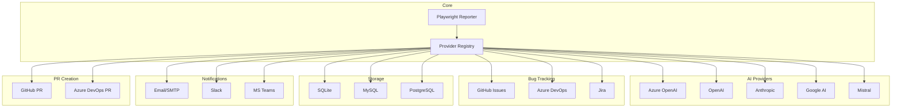

# 📚 Documentation Hub

Welcome to the **Playwright Smart Reporter** documentation! This comprehensive guide will help you get started, configure providers, troubleshoot issues, and extend the reporter.

---

## 🚀 Getting Started

Start here if you're new to the project:

1. **[README (Project Root)](../README.md)** - Overview, features, and why choose this reporter
2. **[QUICKSTART.md](./QUICKSTART.md)** - Get up and running in 5 minutes
3. **[ENV_CONFIG_GUIDE.md](./ENV_CONFIG_GUIDE.md)** - Complete environment configuration with sample setups

---

## 📖 Core Documentation

### Architecture & Design

- **[design.md](./design.md)** - Complete architectural design documentation

    - Solution architecture
    - Component relationships and data flow
    - Design patterns and principles
    - Success metrics and scalability

- **[PROJECT_STRUCTURE.md](./PROJECT_STRUCTURE.md)** - Project structure and organization
    - Directory layout
    - File naming conventions
    - Code organization guide

### API Reference

- **[API.md](./API.md)** - Complete API documentation
    - Provider interfaces (AI, Bug Tracker, Database, PR, Notification)
    - Factory patterns and usage
    - Utility functions
    - Type definitions
    - Best practices and error handling

### Provider Framework

- **[PROVIDERS.md](./PROVIDERS.md)** - Comprehensive provider documentation

    - **AI Providers:** Azure OpenAI, OpenAI, Anthropic Claude, Google Gemini, Mistral AI
    - **Bug Trackers:** GitHub Issues, Azure DevOps Work Items, Jira Tickets
    - **Databases:** SQLite, MySQL, PostgreSQL (coming soon)
    - **Notifications:** Email/SMTP, Slack (coming soon), Teams (coming soon)
    - **PR Providers:** GitHub, Azure DevOps
    - How to add custom providers

- **[IMPLEMENTATION_SUMMARY.md](./IMPLEMENTATION_SUMMARY.md)** - Implementation details
    - Code structure and patterns
    - Technical decisions
    - Implementation notes

---

## ⚙️ Configuration

### Environment Setup

- **[ENV_CONFIG_GUIDE.md](./ENV_CONFIG_GUIDE.md)** - Detailed configuration guide
    - Pre-configured stacks (GitHub, Azure, Jira, etc.)
    - Provider-specific setup instructions
    - Security best practices
    - Configuration validation

### Sample Configurations

Located in `examples/env-configs/`:

- **`.env.github-stack`** - GitHub Issues + Mistral AI + SQLite (recommended for open source)
- **`.env.azure-stack`** - Azure DevOps + Azure OpenAI + MySQL (recommended for enterprise)
- **`.env.openai-jira`** - Jira + OpenAI + SQLite (recommended for startups/agile)
- **`.env.anthropic-minimal`** - Claude AI only (minimal setup)
- **`.env.google-mysql`** - GitHub + Google Gemini + MySQL (cost-effective)

---

## 🔧 Development & Troubleshooting

### Troubleshooting

- **[TROUBLESHOOTING.md](./TROUBLESHOOTING.md)** - Common issues and solutions
    - Configuration issues (AI, PR, Database, Email)
    - Runtime errors and fixes
    - CI/CD troubleshooting
    - Provider-specific issues
    - Performance optimization
    - Debug mode and logging

### Build & Deployment

- **[BUILD_FIXES.md](./BUILD_FIXES.md)** - TypeScript compilation fixes
    - Common build errors
    - Solutions and workarounds
    - Build verification steps

---

## 📋 Quick Reference

### Common Tasks

| Task                    | Documentation                                            |
| ----------------------- | -------------------------------------------------------- |
| First time setup        | [QUICKSTART.md](./QUICKSTART.md)                         |
| Configure providers     | [ENV_CONFIG_GUIDE.md](./ENV_CONFIG_GUIDE.md)             |
| Understand architecture | [design.md](./design.md)                                 |
| API reference           | [API.md](./API.md)                                       |
| Add new provider        | [PROVIDERS.md](./PROVIDERS.md)                           |
| Fix issues              | [TROUBLESHOOTING.md](./TROUBLESHOOTING.md)               |
| Build troubleshooting   | [BUILD_FIXES.md](./BUILD_FIXES.md)                       |
| Implementation details  | [IMPLEMENTATION_SUMMARY.md](./IMPLEMENTATION_SUMMARY.md) |

---

## 🎯 Use Cases

### By Role

**QA Engineers / Test Automation**

1. [QUICKSTART.md](./QUICKSTART.md) - Get started quickly
2. [ENV_CONFIG_GUIDE.md](./ENV_CONFIG_GUIDE.md) - Configure your environment
3. [README](../README.md) - Understand features

**DevOps Engineers**

1. [ENV_CONFIG_GUIDE.md](./ENV_CONFIG_GUIDE.md) - Environment setup
2. [PROVIDERS.md](./PROVIDERS.md) - Provider configuration
3. [design.md](./design.md) - Architecture overview

**Developers / Contributors**

1. [design.md](./design.md) - Understand architecture
2. [IMPLEMENTATION_SUMMARY.md](./IMPLEMENTATION_SUMMARY.md) - Code structure
3. [PROVIDERS.md](./PROVIDERS.md) - Extend providers
4. [BUILD_FIXES.md](./BUILD_FIXES.md) - Build issues

---

## 🏗️ Architecture Overview

See [design.md](./design.md) for detailed architecture diagrams.

---

## 🔗 External Resources

- **Playwright Documentation**: https://playwright.dev/
- **GitHub Issues**: https://github.com/deepakkamboj/playwright-ai-test-reporter/issues
- **License**: [MIT License](../LICENSE)

---

## 📝 Documentation Standards

All documentation in this project follows these standards:

- **Markdown Format**: All docs use GitHub-flavored Markdown
- **Mermaid Diagrams**: For architecture and flow diagrams
- **Code Examples**: Include practical, runnable examples
- **Clear Navigation**: Cross-linked documents for easy navigation

---

## 🆘 Need Help?

1. **Quick Questions**: Check [QUICKSTART.md](./QUICKSTART.md)
2. **Configuration Issues**: See [ENV_CONFIG_GUIDE.md](./ENV_CONFIG_GUIDE.md) troubleshooting section
3. **Build Problems**: Review [BUILD_FIXES.md](./BUILD_FIXES.md)
4. **Architecture Questions**: Read [design.md](./design.md)
5. **Provider Setup**: Consult [PROVIDERS.md](./PROVIDERS.md)

Still stuck? Open an issue on GitHub!

---

## 📅 Document Updates

| Document               | Last Updated | Status     |
| ---------------------- | ------------ | ---------- |
| README                 | Dec 2025     | ✅ Current |
| QUICKSTART             | Dec 2025     | ✅ Current |
| PROVIDERS              | Dec 2025     | ✅ Current |
| ENV_CONFIG_GUIDE       | Dec 2025     | ✅ Current |
| design.md              | Dec 2025     | ✅ Current |
| IMPLEMENTATION_SUMMARY | Dec 2025     | ✅ Current |
| BUILD_FIXES            | Dec 2025     | ✅ Current |

---

**Happy Testing! 🎭✨**
